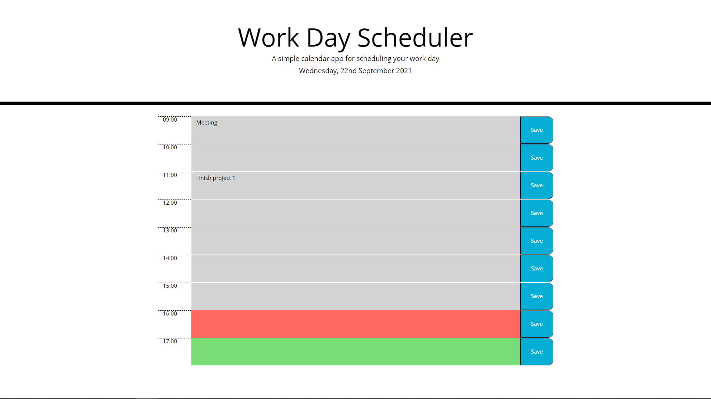

# Work Day Scheduler

This work planner allows the user to save task to do during the day in different time slots.

It is also colour coded. The present time has a background color red, the future on green and the past on grey.

It has been created with **HTML/CSS/JavaScript**.

## Website Screenshots

-This screenshot shows the main page.

## Link to Deployed Application

https://grillogg.github.io/Day-Planner/